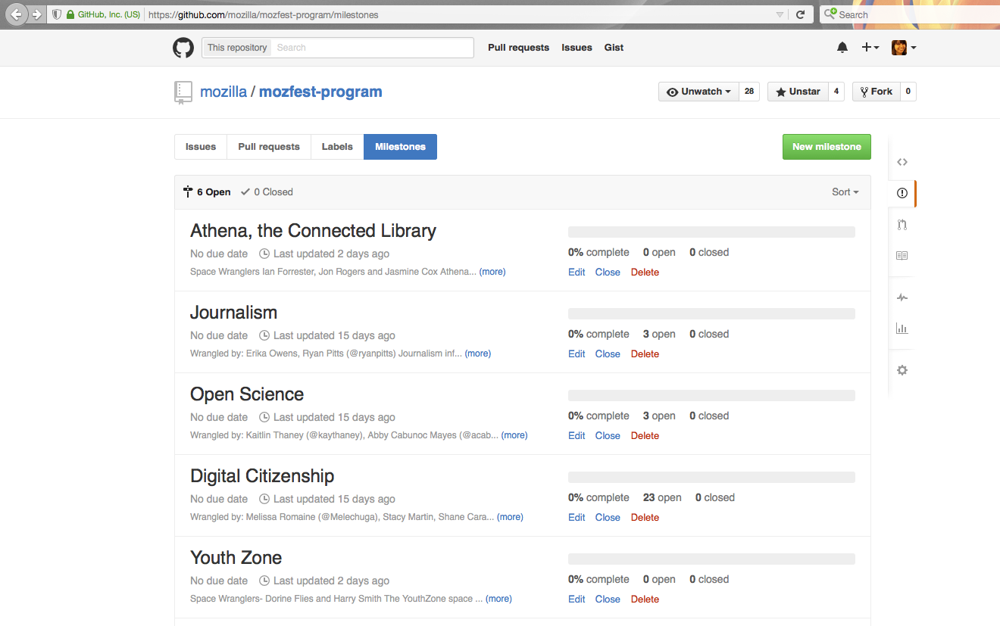
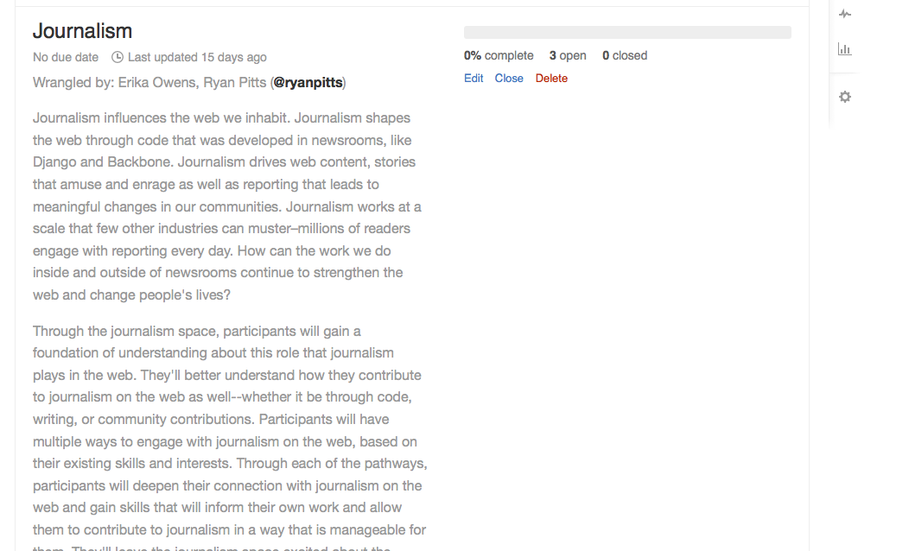
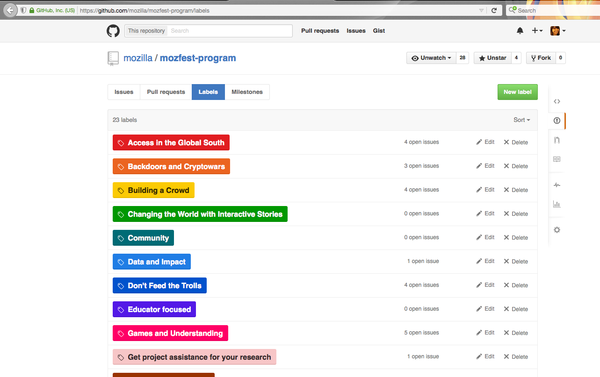
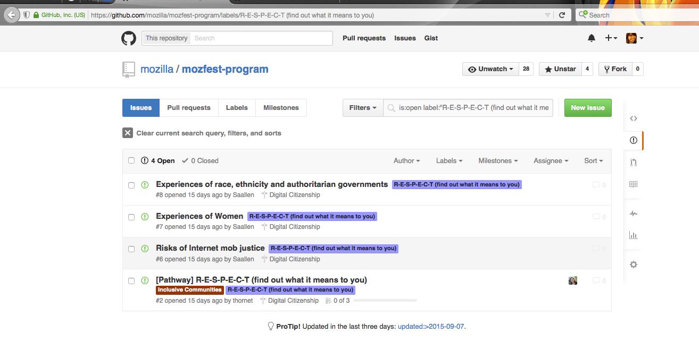
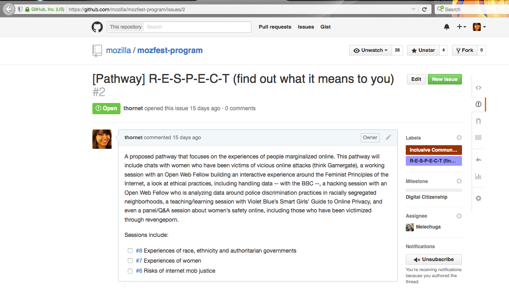

# Mozfest 2015 Program on Github!

Head to this repository's issues, where the Mozfest program data is being reviewed and curated. Questions on how to use this tool or ideas to improve it? Email festival@mozilla.org.

## Overview 

All the Mozfest program data is in the ["Issues"](https://github.com/mozilla/mozfest-program/issues) section of this Github repository. This is a brief tutorial to help you, member of the Mozfest program team, get started with Github Issues.

### Spaces

Each space is represented as a Github ["milestone"](https://github.com/mozilla/mozfest-program/milestones). Each milestone includes description of its respective space. 

Click "(more)" in Issues > Milestones to see the details of a space. 

You can edit the description of your space at any time. 

You can click on the name of a space to see all the associated pathways and sessions. You can modify sessions to be part of your space by adding them to the appropriate "milestone."

### Pathways

Each pathway is represented as a Github ["label."](https://github.com/mozilla/mozfest-program/labels). You can add new labels, change the color and change the name:   

Labels can be applied to sessions (i.e. individual Github issues) to indicate that the session is part of that pathway. You can then search for and see all the sessions that are part of that pathway. There's not limit to the number of labels you can apply to a session. That's great -- we love things that are cross-listed. 

Ideally, each pathway also has what's called a "tracking issue" that provides more information about the pathway. 

### Sessions

Each session is a [Github Issue](https://github.com/mozilla/mozfest-program/issues). They can be easily labeled to be part of a pathway. You can also comment on them, edit them, and "close" them if they are not a good fit for Mozfest. 

## Overview

This year we're using Github to manage, review and curate sessions for Mozfest. This tool will allow us to better collaborate and coordinate across the program, as well as provide a record for how the program came together. 

It is new for us to use Github Issues in this way, but based on some other events who've used it effectively, we think it's a great solution for Mozfest. 
 

We are here to help in case you get stuck or need help at anytime. Don't worry -- you can't break anything! 

## Who is using Github Issues for Mozfest

For Mozfest, we are inviting any Space Wrangler, Pathway Finder or core Mozfest team member to use Github Issues. 

If you are not in one of these roles but are interested to be active in Github Issues with us, please email festival@mozilla.org. Due to the sometimes sensitive nature of our conversations on this platform, please be aware that an invitation to participate is not guaranteed. 

If you are using Github Issues, please be advised that your comments will be recorded and may be viewed publicly at sometime. We will not publish anyone's personal information, and we ask you to be respectful in your comments, both towards the people who submitted sessions and to your fellow program team members.

## Getting started with Github Issues

Github Issues is a powerful way to collaborate on Github. It was originally designed as an "issue tracker" or project management tool for editing code. However, its simple interface allows us to adapt it for Mozfest's program curation.

To get started, you'll first have to [create a Github account.](https://github.com/join)

Once you've created your account, send your Github user name to festival@mozilla.org. You will then be notified that you have access to the Mozfest repository.

## Learning how to use Github Issues

The Mozfest team will offer support for you to use Github Issues in the following ways: 

* **This tutorial!** Is there anything missing or unclear? Let us know how to improve it by emailing: festival@mozilla.org
* **Orientations on the Mozfest program call.** During our regular weekly calls, we will walk the group through the major features and workflows in Github Issues. We'll answer questions and troubleshoot. 
* **1:1 Conversations.** We'll also offer timeslots for anyone interested in having a more in-depth conversation about how to use Github Issues effectively. In addition, we'll be available for any urgent Github questions via email (festival@mozilla.org), Twitter (#mozfest) or on Skype.

## How to review sessions

[in progress] guidelines for choosing, cc yourself if you like it, cc'ing others, when do you assign yourself. 

### Keep
### Tweak
### Hack
### Deny

## How to update your space

## How to update your pathway

## Etiquette

## Improving this process
		
